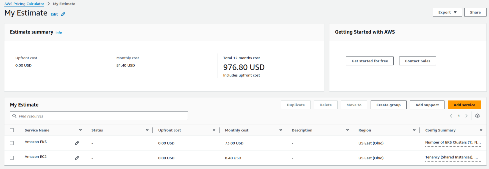

???+ info end "Membros do Grupo (dupla)"

    * João Sarti
    * Caio Liberal

## Objetivo

Como objetivo desta primeira parte, temos fazer a configuração do AWS-CLI, a construção de nosso cluster na AWS e o teste de carga do mesmo. Para isso, seguimos o passo à passo disponibilizado no site.

### Configuração AWS CLI

Este se resume em baixar o aws-cli e utilizar o aws configure com as chaves de acesso

### Criação do Cluster na AWS

Para fazer a criação do cluster, basta seguir o passo a passo fornecido no site:  

Ao final, teremos um cluster que, por padrão, tera duas instancias de subnets publicas e privadas, onde no meio delas existe um load balancer para controlar o tráfego de rede, enquanto as aplicações ficam na subnet privada. Deste modo, temos um sistema seguro onde o ususario comum é incapaz de ter acesso à nossa rede após o load balancer:  

Basta então sincronizarmos com nosso aws-cli usando `aws eks update-kubeconfig --name eks-store` e poderemos acessar nosso cluster remotamente.  
  
IMPORTANTE:  
Para ter acesso ao cluster, foi necessario conceder permissões especialmente ao meu usuario, o mesmo deve ser feito ao de todos que forem se conectar, se não mesmo sendo administrador podemos ter acesso negado; o IAM não compartilha diretamente suas configurações de segurança com o EKS.

### Teste de Carga

Foi-se realizado o teste de carga conforme instruido utilizando um HPA:  
#####################################################################  
##########################VIDEO######################################  
#####################################################################  

### Analise de Custo

Para a analise de custo e viabilidade da aplicação, utilizamos o site https://calculator.aws/[url=https://calculator.aws/]. Todos os calculos foram feito em dolares no servidor US-East-2, mais especificamente com os valores de Ohio.  
Para a analise de custos, levamos em consideração um unico cluster kubernets pela EKS, assim como feito no projeto nas etapas anteriores. Para os calculos utilizamos os valores ja usados anteriormente de 1 cluster EKS, tambem selecionamos uma instancia EC2 t2.small  (a mesma utilizada dentro de nosso EKS) para comparar.

Com isso chegamos no valor de R$5508.08 (USD $976.80) anual ou R$460 (USD $81.40) ao mês. De onde desse valor todo, 89.6% são apenas de um unico cluster do kubernets. Dito isso, a conclusão que conseguimos chegar é que apesar de uma poderosa ferramente, o kubernets não parece se pagar em aplicações pequenas, começando a compensar em um ecosistema robusto onde não seja viavel, pratico e/ou economicamente beneficiavel manejar multiplas instancias ec2.

### PaaS e utilização

Neste projeto podemos observar uma utilização real de PaaS, onde toda a evolução de nosso micro-servico foi feito em torno da versatilidade e independencia dos serviços, onde eles devem ser capazes de rodar em qualquer lugar igualmente. Isto para, justamente, se adequar à nossa abordagem/solução PaaS, que foi justamente o EKS, onde utilizamos o kubernets orquestrado pela amazon para hospedar nossas aplicações e lidar com grande parte da configuração, enquanto nós fornecemos a aplicação em uma instrução .yaml de como executar aquela imagem X, que ja foi compilada e disponibilizada em um pipeline anteriormente.  
Tanto no projeto individual quanto no projeto em grupos, tivemos interações com a AWS com o mesmo objetivo, hospedar nosso serviço em seus servidores