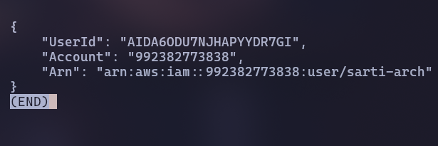
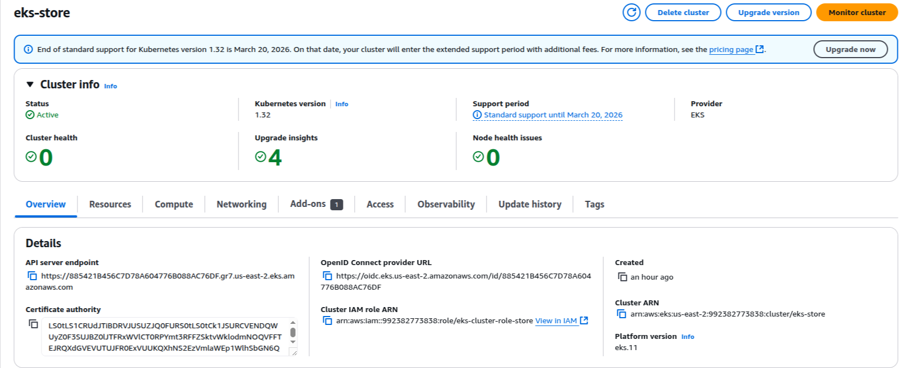
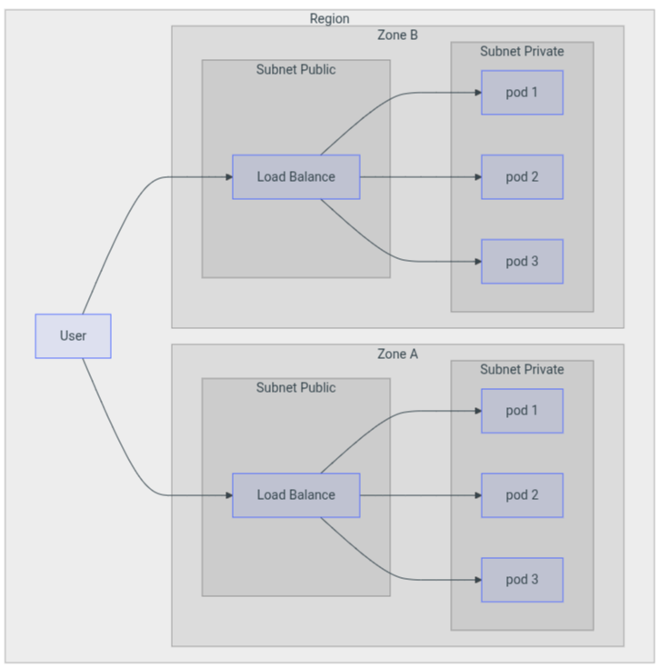
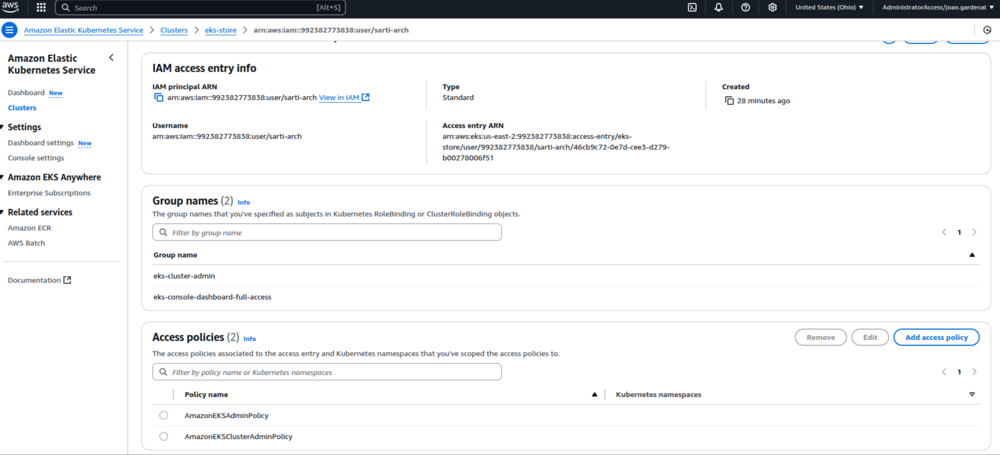

???+ info end "Membros do Grupo (dupla)"

    * João Sarti
    * Caio Liberal

## Objetivo

Como objetivo desta primeira parte, temos fazer a configuração do AWS-CLI, a construção de nosso cluster na AWS e o teste de carga do mesmo. Para isso, seguimos o passo à passo disponibilizado no site.

### Configuração AWS CLI

Este se resume em baixar o aws-cli e utilizar o aws configure com as chaves de acesso

### Criação do Cluster na AWS

Para fazer a criação do cluster, basta seguir o passo a passo fornecido no site:  

Ao final, teremos um cluster que, por padrão, tera duas instancias de subnets publicas e privadas, onde no meio delas existe um load balancer para controlar o tráfego de rede, enquanto as aplicações ficam na subnet privada. Deste modo, temos um sistema seguro onde o ususario comum é incapaz de ter acesso à nossa rede após o load balancer:  

Basta então sincronizarmos com nosso aws-cli usando `aws eks update-kubeconfig --name eks-store` e poderemos acessar nosso cluster remotamente.  
  
IMPORTANTE:  
Para ter acesso ao cluster, foi necessario conceder permissões especialmente ao meu usuario, o mesmo deve ser feito ao de todos que forem se conectar, se não mesmo sendo administrador podemos ter acesso negado; o IAM não compartilha diretamente suas configurações de segurança com o EKS.

### Teste de Carga

Foi-se realizado o teste de carga conforme instruido utilizando um HPA:  
#####################################################################  
##########################VIDEO######################################  
#####################################################################  