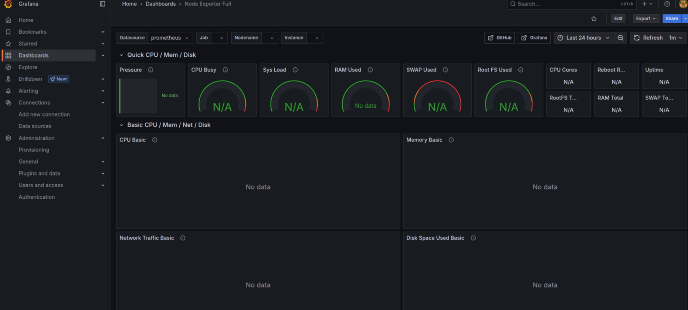
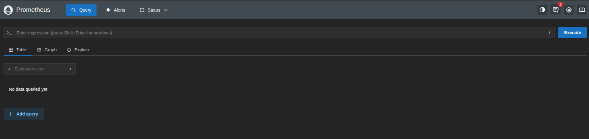

# Bottlenecks Aplicados

### Prometheus + Grafana
Utilizamos o prometheus e o grafana para monitorar os status da aplicação
=== "Grafana k8s"

    ``` { .yaml .copy .select linenums='1' title="grafana.yaml" }
    --8<-- "https://raw.githubusercontent.com/joaopgs4/api-principal/refs/heads/main/api/k8s/grafana.yaml"
    ```

=== "Prometheus k8s"

    ``` { .yaml .copy .select linenums='1' title="prometheus.yaml" }
    --8<-- "https://raw.githubusercontent.com/joaopgs4/api-principal/refs/heads/main/api/k8s/prometheus.yaml"
    ```
=== "Prometheus k8s config"

    ``` { .yaml .copy .select linenums='1' title="prometheus-config.yaml" }
    --8<-- "https://raw.githubusercontent.com/joaopgs4/api-principal/refs/heads/main/api/k8s/prometheus-config.yaml"
    ```

### Redis
Redis foi utilizado na aplicação Product para fazer o caching de produtos para aumentar a resposta na rota get/product/{id}


=== "redis k8s"

    ``` { .yaml .copy .select linenums='1' title="redis.yaml" }
    --8<-- "https://raw.githubusercontent.com/joaopgs4/api-principal/refs/heads/main/api/k8s/redis.yaml"
    ```

  
  