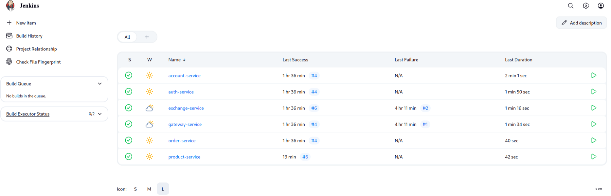
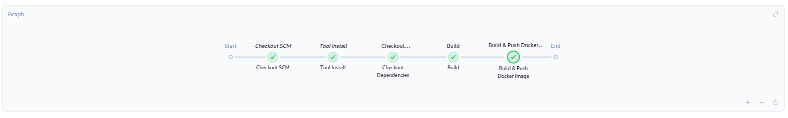
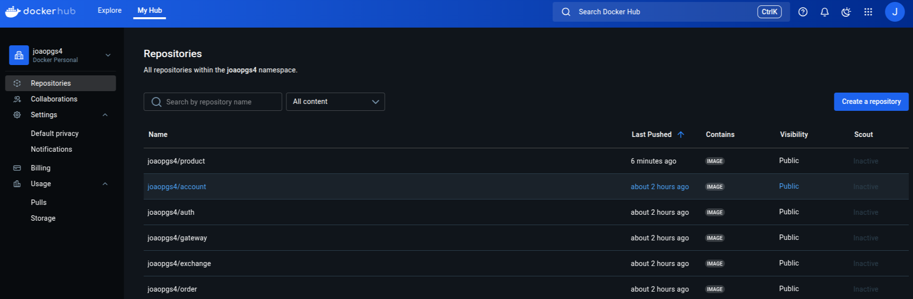

## Objetivo

Fazer a automatização do processo de compilar, enviar para o docker hub, puxar a imagem e iniciar os processos com kubernets. Para isso, no exercicio 4 usamos o jenkins para esta primeira função, de monitorar o github para mudanças e, ao detecta-las, fazer uma nova build para nosso docker hub.

## Montagem do Exercicio

Para a realizaçao deste exercicio, precisamos criar um jenkins file em todos os nossos microserviços, ele que sera responsavel por instruir o jenkins quais passos devem ser seguidos para compilar com sucesso nosso programa e gerar o docker. Tambem é ele que acaba lidando com dependencias de diferentes módulos (como product para o product-service), extraindo a dependencia de nosso rep no github.


### Jenkinsfiles

Jenkinsfile que instrui a execução de cada processo para nosso jenkins principal (todas as variaveis de hambiente são definidas no próprio Jenkins, e não em um .env)

=== "account-service Jenkins"

    ``` { .copy .select linenums='1' title="Jenkinsfile" }
    --8<-- "https://raw.githubusercontent.com/joaopgs4/account-service/refs/heads/main/Jenkinsfile"
    ```

=== "order-service Jenkins"

    ``` { .copy .select linenums='1' title="Jenkinsfile" }
    --8<-- "https://raw.githubusercontent.com/joaopgs4/order-service/refs/heads/main/Jenkinsfile"
    ```

=== "account-service Jenkins"

    ``` { .copy .select linenums='1' title="Jenkinsfile" }
    --8<-- "https://raw.githubusercontent.com/joaopgs4/account-service/refs/heads/main/Jenkinsfile"
    ```

=== "auth-service Jenkins"

    ``` { .copy .select linenums='1' title="Jenkinsfile" }
    --8<-- "https://raw.githubusercontent.com/joaopgs4/auth-service/refs/heads/main/Jenkinsfile"
    ```

=== "exchange-service Jenkins"

    ``` { .copy .select linenums='1' title="Jenkinsfile" }
    --8<-- "https://raw.githubusercontent.com/joaopgs4/exchange-service/refs/heads/main/Jenkinsfile"
    ```

=== "gateway-service Jenkins"

    ``` { .copy .select linenums='1' title="Jenkinsfile" }
    --8<-- "https://raw.githubusercontent.com/joaopgs4/gateway-service/refs/heads/main/Jenkinsfile"
    ```

### Imagens
  
  
