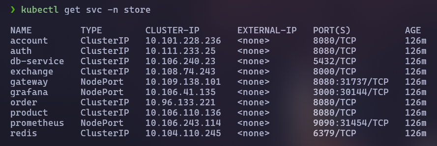

## Objetivo

Fazer a automatização do processo de compilar, enviar para o docker hub, puxar a imagem e iniciar os processos com kubernets. Este exercicio 5 cuida desta segunda parte, sendo ela justamente o deploy com pull automatico do dockerhub utilizando Kubernets (ou no nosso caso, minikube)

## Montagem do Exercicio

Para a realizaçao deste exercicio, precisamos criar um k8s.yaml para todos os microserviços. Este é basicamente um dockerfile especial que explica para o kubernet como iniciar ele para funcionar em conjunto aos outros microserviços.


### k8s

Os arquivos .yaml que definem como executar as aplicações e dar pull em seus respectivos containers

=== "account-service k8s.yaml"

    ``` { .yaml .copy .select linenums='1' title="k8s.yaml" }
    --8<-- "https://raw.githubusercontent.com/joaopgs4/account-service/refs/heads/main/k8s/k8s.yaml"
    ```

=== "order-service k8s.yaml"

    ``` { .yaml .copy .select linenums='1' title="k8s.yaml" }
    --8<-- "https://raw.githubusercontent.com/joaopgs4/order-service/refs/heads/main/k8s/k8s.yaml"
    ```

=== "account-service k8s.yaml"

    ``` { .yaml .copy .select linenums='1' title="k8s.yaml" }
    --8<-- "https://raw.githubusercontent.com/joaopgs4/account-service/refs/heads/main/k8s/k8s.yaml"
    ```

=== "auth-service k8s.yaml"

    ``` { .yaml .copy .select linenums='1' title="k8s.yaml" }
    --8<-- "https://raw.githubusercontent.com/joaopgs4/auth-service/refs/heads/main/k8s/k8s.yaml"
    ```

=== "exchange-service k8s.yaml"

    ``` { .yaml .copy .select linenums='1' title="k8s.yaml" }
    --8<-- "https://raw.githubusercontent.com/joaopgs4/exchange-service/refs/heads/main/k8s/k8s.yaml"
    ```

=== "gateway-service k8s.yaml"

    ``` { .yaml .copy .select linenums='1' title="k8s.yaml" }
    --8<-- "https://raw.githubusercontent.com/joaopgs4/gateway-service/refs/heads/main/k8s/k8s.yaml"
    ```

=== "db k8s"

    ``` { .yaml .copy .select linenums='1' title="db.yaml" }
    --8<-- "https://raw.githubusercontent.com/joaopgs4/api-principal/refs/heads/main/api/k8s/db.yaml"
    ```

### Imagens
